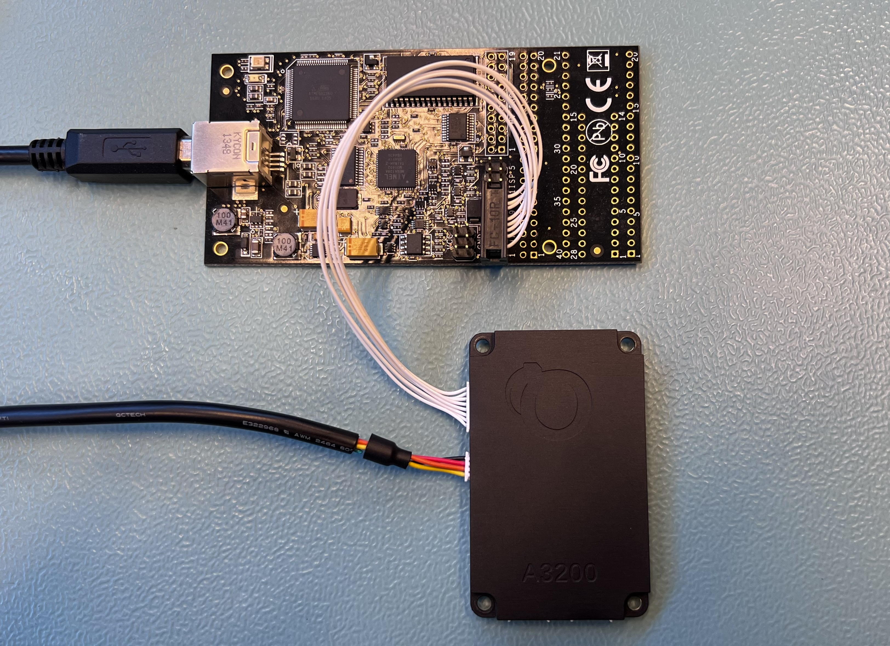
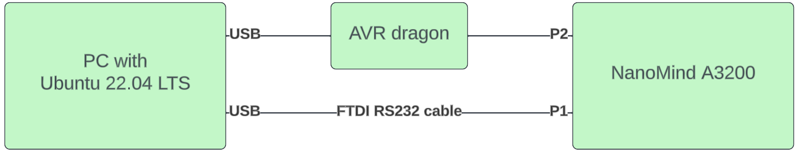

.. _avr_programmer:

Programming using AVR dragon
----------------------------

Introduction
============

This guide details how to program an AVR32 MCU on one or more GomSpace products using the AVR dragon JTAG programmer.
While the guide is tailered towards the NanoMind A3200, the guide is also usable for several NanoCom- and NanoPower products.

This guide demonstrates a basic hardware setup using a NanoMind A3200. For further information on connections and power, please refer to the product manual.

Prerequisites to use this guide:

1. The device is powered on and connected to the programmer
2. An intermediate understanding of Debian-based Linux
3. The AVR toolchain is installed

This repository is either included in a product manual or downloaded directly from Github using::

  $ git clone git@github.com:GomSpace/avr32-prog.git

Installation
============

Please make sure that your current working directory is the root of avr32-prog::

  $ cd <path-to-avr32-prog>

Then install the Python package using::

  $ pip install avr_dragon/

Copy udev rules to /etc/udev/rules.d::

  $ sudo cp avr_dragon/99-avr-dragon.rules /etc/udev/rules.d/

Run commands to reload rules::

  $ sudo udevadm control --reload-rules
  $ sudo udevadm trigger

Add user to dialout::

  $ sudo adduser $USER dialout

Disconnect- and reconnect the programmer.

Hardware setup
==============

An example hardware setup for the NanoMind A3200 is shown below.

In this setup, the NanoMind A3200 is powered through an FTDI RS232 cable and connected to a PC with an Ubuntu 22.04 installation.

The NanoMind A3200 is powered via the FTDI adapter using a 3.3 V power line.

   AVR dragon (upper), FTDI/USB (lower cable), A3200 (lower right)

   Block diagram of connected components

Usage
=====

After installation, the script can be used from any Linux terminal using the :code:`avrprogram` command::

  $ avrprogram --help
  usage: avrprogram [-h] [-v] [-E] <elf file>

  positional arguments:
    <elf file>       .elf file to program

  options:
    -h, --help       show this help message and exit
    -v, --verify     Verify memory after programming (omit to quickprogram) (default: False)
    -E, --chiperase  Erase chip before programming (default: False)

The most common set of options for the NanoMind A3200 (and NanoCom- and NanoPower products) will be::

  $ avrprogram -E -v <path to .elf file>

E.g.::

  $ avrprogram -E -v ~/a3200-sdk/build/nanomind.elf